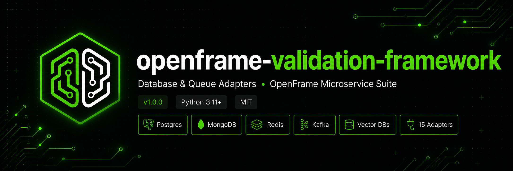

<p align="center">
  
</p>

<p align="center">
  <a href="https://github.com/amrit2356/openframe-local-validation-framework"></a>
  <a href="https://github.com/amrit2356/openframe-local-validation-framework"></a>
  <a href="https://github.com/amrit2356/openframe-local-validation-framework/blob/production/LICENSE"></a>
  <a href="https://furious-meteors.github.io/openframe-core/"></a>
</p>

<p align="center">
  <a href="#quick-start">Quick Start</a> ·
  <a href="#services">Services</a> ·
  <a href="#architecture">Architecture</a> ·
  <a href="#running-tests">Tests</a>
</p>

---

`openframe-local-validation` proves that `openframe-adapters` and `openframe-core` work correctly against real backends. It is not a production service and not a tutorial — it is an engineering validation tool. Each service is the minimal possible FastAPI app that exercises a specific adapter end to end.

---

## Quick start

```bash
# 1. Start all backends
docker compose up -d

# 2. Wait for all backends to be healthy
docker compose ps

# 3. Start each service in a separate terminal
cd services/items-postgres && pip install -e ".[dev]" && uvicorn src.entrypoints.http.main:app --port 8001
cd services/artifacts-mongo && pip install -e ".[dev]" && uvicorn src.entrypoints.http.main:app --port 8002
cd services/cache-redis     && pip install -e ".[dev]" && uvicorn src.entrypoints.http.main:app --port 8003
cd services/events-kafka    && pip install -e ".[dev]" && uvicorn src.entrypoints.http.main:app --port 8004
cd services/swap-demo       && pip install -e ".[dev]" && uvicorn entrypoints.http.main:app --port 8005

# 4. Run the full validation suite
bash scripts/validate_all.sh
```

---

## Services

| Service | Port | Adapter | What it validates |
|---|---|---|---|
| `items-postgres` | 8001 | `openframe-adapters-db-postgres` | `PostgresRepository[T]` CRUD · asyncpg COPY bulk · filtered query |
| `artifacts-mongo` | 8002 | `openframe-adapters-db-mongo` | `MongoRepository[T]` CRUD · `$in` tag filter · regex search |
| `cache-redis` | 8003 | `openframe-adapters-db-redis` | `RedisRepository[T]` · `EXPIRE` TTL · `PIPELINE` stats |
| `events-kafka` | 8004 | `openframe-adapters-queue-kafka` | `KafkaProducer[T]` · `KafkaConsumer[T]` · keyed publish · background consumer |
| `swap-demo` | 8005 | Postgres **or** Mongo | Adapter swap via `PERSISTENCE_BACKEND` env var — zero code change |

---

## Architecture

Each service follows the DDD-lite structure from the OpenFrame architectural spec:

```
src/
├── domain/              ← entity (Pydantic BaseModel) — no infrastructure imports
├── application/
│   ├── ports/           ← application-specific port (Protocol)
│   └── services/        ← business logic — depends on port, never on adapter
├── adapters/outbound/   ← openframe adapter subclass
├── entrypoints/http/    ← FastAPI routes + main.py
└── bootstrap/           ← dependencies.py (composition root)
```

### Hexagonal boundary

```
HTTP request
    │
    ▼
routes.py          ← depends on ItemService (domain language)
    │
    ▼
item_service.py    ← depends on ItemRepositoryPort (Protocol)
    │
    ▼
TracingProxy       ← zero-code OTel spans on every repo method
    │
    ▼
ItemPostgresRepository  ← only file that imports openframe.adapters
    │
    ▼
PostgresRepository[T]   ← openframe-adapters base class
    │
    ▼
asyncpg / motor / redis.asyncio / aiokafka
```

The three rules that every service enforces (and the architecture tests verify):

1. `src/domain/` and `src/application/` **never** import from `openframe.adapters`
2. `src/adapters/outbound/` is the **only** file that touches driver-level code
3. `src/bootstrap/dependencies.py` is the **only** file that wires adapter to service

### Wiring pattern

All Phase 1 services use Stage 1 wiring — one adapter, `lru_cache` direct, no `PluginRegistry` needed:

```python
# bootstrap/dependencies.py
@lru_cache(maxsize=1)
def _get_settings() -> PostgresSettings:
    return PostgresSettings()          # reads DATABASE_URL from env, fails fast

@lru_cache(maxsize=1)
def _get_repository() -> ItemPostgresRepository:
    return ItemPostgresRepository(_get_settings())

def get_item_service() -> ItemService:
    traced = TracingProxy(_get_repository(), prefix="repository.item")
    return ItemService(traced)
```

---

## What each service proves

### `items-postgres`

- `PostgresSettings` reads `DATABASE_URL` from env
- asyncpg pool creation and caching against real Postgres
- `_row_to_entity()` / `_entity_to_row()` on real `asyncpg.Record`
- Full CRUD: `create()` → `get()` → `list()` → `update()` → `delete()`
- **Niche 1:** asyncpg `COPY` protocol for bulk insert (`bulk_import`)
- **Niche 2:** raw asyncpg filtered query (`find_by_status`)
- `TracingProxy` produces real OTel spans · `TelemetryMiddleware` instruments HTTP

### `artifacts-mongo`

- `MongoSettings` reads `MONGO_URL` and `MONGO_DATABASE` from env
- Motor lazy connection against real MongoDB
- `_id` ↔ `id` string conversion on real documents
- **Niche 1:** MongoDB `$in` query for tag filtering (`filter_by_tags`)
- **Niche 2:** case-insensitive regex search across title + abstract (`search`)
- `EmbeddingStatus` enum lifecycle — preview of Research Vault Phase 1

### `cache-redis`

- `RedisSettings` reads `REDIS_URL` from env
- JSON serialisation/deserialisation round-trip on real Redis
- `SET NX` create · `SET XX` update · `SCAN ITER` pagination
- **Niche 1:** `EXPIRE` command for TTL extension (`extend_ttl`)
- **Niche 2:** Redis `PIPELINE` for atomic multi-command stats query (`get_stats`)
- `RedisPlugin.capability = "cache"` — validated as the cache layer, not persistence

### `events-kafka`

- `KafkaSettings` reads `KAFKA_BOOTSTRAP_SERVERS` from env
- `KafkaProducer.start()` connects to real Kafka broker (KRaft, no Zookeeper)
- JSON → bytes serialisation with broker delivery acknowledgement
- **Niche 1:** keyed publish for partition routing (`publish_keyed`)
- **Niche 2:** topic metadata via raw aiokafka producer (`get_topic_metadata`)
- Background `asyncio.Task` consumer — observable via `GET /events/received`
- Graceful degraded startup when Kafka is not yet ready

### `swap-demo`

- Selects `PostgresSwapRepository` or `MongoSwapRepository` at startup via `PERSISTENCE_BACKEND`
- Identical `SwapItemService` — service layer never knows which backend is active
- `/info` reports the active backend
- Proves the hexagonal contract: **swap the adapter, keep the service**

---

## Running tests

Each service has a full unit test suite. Zero network calls — all adapter interactions mocked.

```bash
cd services/items-postgres && pytest tests/ -v    # 57 tests
cd services/artifacts-mongo && pytest tests/ -v   # ~40 tests
cd services/cache-redis && pytest tests/ -v       # ~35 tests
cd services/events-kafka && pytest tests/ -v      # 26 tests
cd services/swap-demo && pytest tests/ -v         # ~25 tests
```

Test coverage per service:

| Layer | What's tested |
|---|---|
| Domain | Entity defaults · field validation · no infrastructure imports |
| Service | Business logic · delegation to port · architecture boundary |
| Adapter | Protocol conformance · mapping methods · niche feature behaviour |
| Routes | Status codes · request/response shapes · 404 / 422 handling |
| Architecture | AST-level import boundary checks |

---

## Backends

```yaml
postgres:  image: postgres:16-alpine   port: 5432
mongo:     image: mongo:7              port: 27017
redis:     image: redis:7-alpine       port: 6379
kafka:     image: confluentinc/cp-kafka:7.6.0  port: 9092  # KRaft mode
```

All credentials default to `openframe / openframe`. See `.env.example` for the full list of environment variables.

> **Kafka note:** KRaft mode takes 30–60 s to elect a controller on first boot. The `events-kafka` service handles `AdapterConnectionError` at startup and runs in degraded mode until Kafka is ready.

---

## Ecosystem

| Package | Description |
|---|---|
| [`openframe-core`](https://github.com/Furious-Meteors/openframe-core) | Exceptions · ports · telemetry · middleware — foundation for the entire ecosystem |
| [`openframe-adapters`](https://github.com/Furious-Meteors/openframe-adapters) | DB + queue adapters — Postgres · MongoDB · Redis · Kafka |
| [`openframe-protocol`](https://github.com/Furious-Meteors/openframe-protocol) | WebSocket · SSE · gRPC · MCP · webhooks |
| [`openframe-infra`](https://github.com/Furious-Meteors/openframe-infra) | Storage · auth · secrets · observability · feature flags |
| [`openframe-ai`](https://github.com/Furious-Meteors/openframe-ai) | LangChain · LlamaIndex · CrewAI · model serving |

---

## License

MIT — see [LICENSE](LICENSE).
